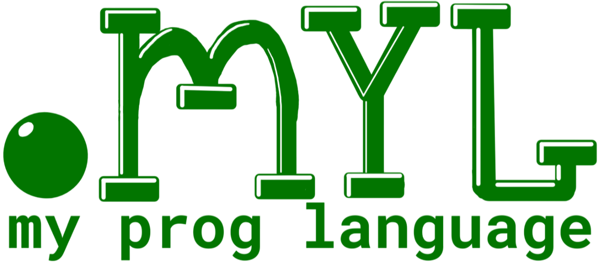
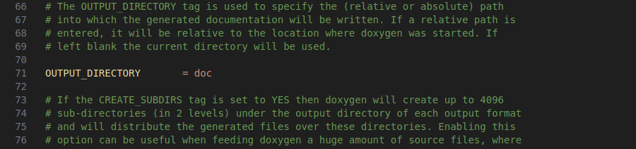

# My Language

## Table of Contents
1. [Description of the Language Structure in the Form of RBNF](#description-of-the-language-structure-in-the-form-of-rbnf)
2. [💪 Language Capabilities](#-language-capabilities)
    - [Equations](#equations)
    - [If-Constructions](#if-constructions)
    - [For-Constructions](#for-constructions)
    - [Functions and Calling of Them](#functions-and-calling-of-them)
3. [🚀 Fast Start](#-fast-start)
    - [Program for Calculating Factorial](#program-for-calculating-factorial)
    - [Program for Calculating Fibonacci Numbers](#program-for-calculating-fibonacci-numbers)
    - [Simple Program for Solving Quadratic Equations](#simple-program-for-solving-quadratic-equations)
4. [How to run your program on my language in your PC](#how-to-run-your-own-program-on-my-language-in-your-pc)
5. [Addition (Editor, Editor Extensions)](#addition-editor-editor-extensions)
    - [Doxygen](#doxygen-for-linux)
    - [LaTeX](#latex)
## Description of the language structure in the form of RBNF
```
GENERAL ::= {CHOOSE_APPR_or_IF_or_FOR_or_FUN_or_RET GET_NEWLINE}*

CHOOSE_APPR_IF_FOR_FUN_RET ::= GET_IF | GET_APPR | GET_FOR | GET_RET | GET_PR 

GET_IF ::= 'if' MATH_LEVEL_60 ('==' | '!=' | '<' | '>' | '<=' | '>=') MATH_LEVEL_50 '{' MAIN '}'
GET_APPR ::= MATH_LEVEL_60 '=' E <-----------------------------------------  appropriation
GET_FOR ::= 'for' DEF_VAR '..' MATH_LEVEL_4 { BODY } 
GET_PR = MATH_LEVEL_10 <---------------------------------------------------  print
GET_RET = MATH_LEVEL_10 <--------------------------------------------------  return
MATH_LEVEL_10 ::= MATH_LEVEL_2 { [+-] MATH_LEVEL_2 }*
MATH_LEVEL_20 ::= MATH_LEVEL_3 { [*/] MATH_LEVEL_3 }*
MATH_LEVEL_30 ::= '(' MATH_LEVEL_1 ')' | MATH_LEVEL_4
MATH_LEVEL_40 ::= MATH_LEVEL_50 | MATH_LEVEL_60
MATH_LEVEL_50 ::= [0-9]+
MATH_LEVEL_60 ::= [a-z]+
```

## 💪 Language capabilities

### Equations
You can create different and creative equations. In this regard, the language is very well expended. </b>
So, you can do like this
```
secondVar = 90 + firstVar * (1 + get()) / 120 - sin(130) + get()
```
This is a rather difficult example. The program asks you to enter a number, one is added to this number. This bracket is then multiplied by the first variable. Next, 90 is added and the sine of 130 radians is subtracted. The program will again ask for a new number and add it to the entire expression. That's how it is. Fuhhh...
> [!IMPORTANT]
> - Unfortunately, the design doesn't support numbers in variables, be careful.

### If-constructions
In the if constructions, you can use the signs <, >, <=, >=, !=, == for comparison. In comparisons, 
you can compare variables and numbers (the order is not important).

> [!IMPORTANT]
> - Unfortunately, the design only supports one comparison and no more.
> - There is also no else and else if.

There is some examples:
Use variables
```
if yourVariable1 == yourVariable2
{
    There is body of if
}
```
Use numbers
```
if yourVariable1 <= 90
{
    There is body of if
}
```

### For-constructions

You can create cycles which get only one iterator. How to write them? It's not difficult, I showed 
an example below. But how does it work internally? Essentially, the program creates i = 0 and the 
system variable _end = 4 is created. 
> [!WARNING]
>For this reason, I strongly recommend not using underscores in front of your variables.

Afterwards, the program adds 1 to i. When i will be greater then _end, the cycle will stop.
```
for i = 0..4 ++
{
    There is body of for
}
```
### Functions and calling of them
You can create functions which get only one parametr and return only one number. How to write them?
The example of function which is nothing return:
```
func myFunc(a)
{
    print(a)
    return()
}
```
The example of function with local variable x which return number:
```
func myFunc(a)
{
    x = a + 1
    return(x)
}
```
To call functions and start programming in my language, you need to write the main function.
>[!IMPORTANT]
> - You must write <b>main()</b> firstly
> - main function nothing return but you must to write <b>return()</b> in the end of main function.

Example:
```
main()
func main()
{
    a = myFunc(1)
    print(a)
    return()
}
func myFunc(a)
{
    x = a + 1
    return(x)
}
```
**Update 2.0** </br> You can differentiate mathematical expressions. In math expression you should use only x-variable or numbers if you need
```
main()
func main()
{
    x = 100
    b = sin(x)+cos(x)
    a = diff(b)
    print(a)
    return ()
}

```

## 🚀 Fast start
### Program for calculating factorial
```
main()
func main()
{
    a = 1
    a = factorial(a)
    print(a)
    return ()
}
func factorial(x)
{
    if x != 1
    {
        f =    x   -   1
        x = x * factorial(f)
    }
    return (x)
}
```

### Program for calculating Fibonacci numbers
```
main()
func main()
{
    a = 1
    b = 1
    print(a)
    for i=0..5 ++
    {
        print(b)
        t = a
        a = b
        b = t + b
    }
    return ()
}
```
### Simple program for solve quad equations
```
main()
func main()
{
    a = get()
    b = get()
    c = get()
    diskr = b^2 - 4*a*c
    if diskr > 0
    {
        first = ((0-1)*b + sqrt(diskr))/(2*a)
        second = ((0-1)*b - sqrt(diskr))/(2*a)
        print(first)
        print(second)
        return ()
    }
    if diskr == 0
    {
        first = ((0-1)*b + sqrt(diskr))/(2*a)
        print(first)
        return ()
    }
    return ()
}
```

## How to run your own program on my language in your pc
- download this repository
- go to this downloaded repository on your pc in terminal
- copy file path of file which contain your program </br> (fast start you can open myProgLang_files/program.myl in downloaded repository)
- run this file by this command ./run.sh <file_path> in terminal. </br> As example in previous paragraph:
``` 
./run.sh ../myProgLang_files/program.myl
```
- you will see output of your program in terminal

## Addition (editor, editor extensions)

To write the project, I used the VS Code editor.</br>
I have different extensions for it:
### Doxygen (for Linux)
- Download doxygen
    ```
    sudo apt-add-repository universe
    sudo apt-get update
    sudo apt-get install doxygen
    ```

- Download doxygen extension
    Go to VS Code extensions, download <b>Doxygen Documentation Generator</b> and <b>Doxygen Runner</b>
    Then open settings.json (ctrl + shift + p and find this file) and add this code:
    ```
    {
        "doxygen_runner.configuration_file_override": "${workspaceFolder}/Doxyfile"
    }
    ```

- Create Doxyfile
    You can copy my doxyfile or create your own by opennid doxygen by this command in terminal:
    ```
    doxywizard
    ```
    Create your settings in <b>Expert</b>. Then go to <b>Run</b> and click on <b>Show configuration</b>. Copy this code, create Doxyfile in your repository from which you will run doxygen in your repository and paste this code in it.

- Now we are ready for running doxygen in VS Code
    Press ctrl + shift + p and write <b>Generate Doxygen documentation</b> and click on it. You will see your documentation in <b>doc</b> folder in your repository. Or you can create your own output folder
    

- Go to this folder and find index.html, open it in your browser and be surprised!

### Latex
- Download Latex
    ```
    sudo apt-get install texlive-full
    ```

- Download Latex extension
    Go to VS Code extensions, download <b>LaTeX Workshop</b>
    Then open settings.json (ctrl + shift + p and find this file) and copy code from [latex settings for settings.json](forReadme/latexSettingJson.txt).

- Now we are ready for running latex in VS Code.
    Create .tex file in your repository and write your code. Then press ctrl + s and you will see your auto generate pdf file in your repository.
